# Vaultic Treasury OS

> **Encrypt. Control. Execute.**
> A privacy-first, encrypted, bridgeless treasury OS for DAOs on Solana.

## Deployed Links

| Service | URL |
|---------|-----|
| **Frontend (Live)** | https://vaultic-frontend.vercel.app |
| **Backend API** | https://vaultic-backend-w7et.onrender.com |
| **Vaultic Program (Devnet)** | 5igWLTbdAjGfAZKsK9G3Buhe7mkrgC3GEYkQaD4PrTnZ |
| **Encrypt Program** | 4ebfzWdKnrnGseuQpezXdG8yCdHqwQ1SSBHD3bWArND8 |
| **Ika Program** | 87W54kGYFQ1rgWqMeu4XTPHWXWmXSQCcjm8vCTfiq1oY |

## Warning: Pre-Alpha

**DEVNET ONLY — ALL DATA WILL BE RESET AT THE ALPHA 1 TRANSITION.**

Both Encrypt and Ika are pre-alpha on Solana Devnet. Do not submit real data or rely on any security guarantees.

- **Encrypt** (4ebfzWdKnrnGseuQpezXdG8yCdHqwQ1SSBHD3bWArND8) — FHE computation over encrypted data. CPI is wired but the devnet event_authority PDA is not yet initialized; Encrypt CPIs are bypassed with placeholder values on devnet.
- **Ika** (87W54kGYFQ1rgWqMeu4XTPHWXWmXSQCcjm8vCTfiq1oY) — Distributed MPC signing via dWallets. The Ika devnet MPC network is not yet processing transactions; Ika CPIs are wired but inactive on devnet.

## What is Vaultic?

Vaultic is a decentralized treasury operating system for DAOs and Web3-native organizations on Solana. It enables organizations to manage their entire financial operations — encrypted payroll, cross-chain payments, and programmable spending governance — with complete privacy and zero reliance on centralized intermediaries.

### The Problems Vaultic Solves

| Problem | Impact | Vaultic Solution |
|---------|--------|-----------------|
| **Salary privacy on public blockchains** | Every on-chain payment is visible to competitors, employees, and the public. DAOs cannot move payroll on-chain without exposing compensation. | FHE encryption via Encrypt — salaries are computed and stored encrypted; no one sees plaintext. |
| **Centralized payroll infrastructure** | DAOs using Deel, Bitwage, or manual multisigs expose themselves to counterparty risk. Multiple providers froze withdrawals in 2022-2023. | Fully on-chain payroll program — no third-party processor, no single point of failure. |
| **Cross-chain payment complexity** | Paying employees in ETH or BTC from a Solana treasury requires bridges. Over \ stolen from bridges since 2021. | Bridgeless native signing via Ika dWallets — no wrapping, no bridges, no custodians. |
| **No programmable spending controls** | DAO treasuries lack approval workflows and time-locks enforced by code. A single compromised key can drain everything. | On-chain spending policies with M-of-N approvals, time-locks, and per-transaction limits. |

### Target Users

- **DAO administrators** managing contributor payroll and treasury operations
- **Web3-native organizations** that want the benefits of blockchain (trustlessness, auditability) without sacrificing salary privacy
- **Multi-chain DAOs** that need to pay contributors in their preferred currency (SOL, ETH, BTC) without bridges

### Use Cases

1. **Encrypted payroll** — Register employees with encrypted salaries, run monthly payroll with FHE computation, employees claim vested amounts
2. **Cross-chain salary payments** — Employee chooses Ethereum; treasury signs a native ETH transaction via Ika dWallet without any bridge
3. **Multi-sig treasury governance** — Create spending policies requiring 3-of-5 approver signatures with a 24-hour time-lock before any large payment executes
4. **Vesting schedules** — Employees have on-chain vesting with cliff periods; claims are automatically gated by the smart contract

## How Vaultic Uses Encrypt

Encrypt is a Fully Homomorphic Encryption (FHE) protocol on Solana. FHE allows computations on encrypted data without ever decrypting it.

### Encrypt Integration Points

| Instruction | Encrypt CPI | Purpose |
|-------------|-------------|---------|
| 
register_employee | create_plaintext_ciphertext x3 | Encrypt salary, bonus, performance score before writing to chain |
| execute_payroll_computation | execute_graph(compute_total_payout) | Compute total payout across encrypted salary + bonus + vested amount |
| compute_bonus | execute_graph(compute_bonus_amount) | Compute bonus from encrypted performance score vs threshold |
| set_payroll_config | create_plaintext_ciphertext x10 | Encrypt salary band min/max values for all 5 role tiers |
| 
request_salary_decryption | 
request_decryption | Employee requests to see their own salary |
| 
reveal_salary | 
read_decrypted_verified | Employee reads decrypted salary via set_return_data (never stored) |
| approve_payroll_message | execute_graph(check_policy_compliance) | Verify encrypted payroll total is within spending limit without revealing the amount |

### FHE Functions (5 computation graphs)

`
ust
// Clamp salary within role band — all values stay encrypted
compute_salary_in_band(salary: Uint64, band_min: Uint64, band_max: Uint64) -> Uint64

// Compute bonus based on encrypted performance vs threshold
compute_bonus_amount(base_salary: Uint64, performance: Uint64, threshold: Uint64, multiplier_bps: PUint64) -> Uint64

// Compute vested amount from total allocation and elapsed time
compute_vested_amount(total_allocation: Uint64, elapsed: Uint64, cliff: Uint64, duration: Uint64) -> Uint64

// Sum salary + bonus + vested — result stays encrypted
compute_total_payout(salary: Uint64, bonus: Uint64, vested: Uint64) -> Uint64

// Policy compliance check — reveals only a 1-bit boolean (within limit or not)
check_policy_compliance(amount: Uint64, limit: PUint64) -> Bool
`

### Privacy Guarantee

Salary, bonus, and performance data **never exist in plaintext on-chain**. The only plaintext revealed is:
- A 1-bit boolean (is the payroll within the spending limit?) during policy enforcement
- The employee's own salary, returned via set_return_data in their own transaction — never written to any account

## How Vaultic Uses Ika

Ika is a decentralized Multi-Party Computation (MPC) network providing dWallets — distributed wallets whose signing keys are never held by any single party.

### Ika Integration Points

| Instruction | Ika CPI | Purpose |
|-------------|---------|---------|
| create_dwallet | Read-only verification | Bind an Ika dWallet to the treasury; verify the dWallet authority matches the Vaultic CPI authority PDA |
| approve_payroll_message | approve_message (raw CPI) | Request Ika MPC network to sign the cross-chain payroll transaction after policy compliance is verified |
| process_claim | approve_message (raw CPI) | Request Ika MPC network to sign the employee's cross-chain claim transaction |

### Why Raw CPI for Ika

Ika uses Anchor 1.0 while Vaultic uses Anchor 0.32 (required by Encrypt). These versions are binary-incompatible. Vaultic constructs Ika instructions byte-by-byte (1-byte discriminator + serialized args) rather than using the Ika Anchor crate, allowing both protocols to coexist in the same program.

### Bridgeless Cross-Chain Flow

`
Employee submits claim (Solana) 
  → Vaultic verifies vesting + policy (Solana)
  → Vaultic calls Ika approve_message (Solana → Ika program)
  → Ika MPC validators reach threshold consensus (off-chain)
  → Ika writes signature on-chain (Solana)
  → Backend broadcasts signed native transaction (ETH/BTC/SOL)
  → Employee receives payment natively on target chain
`

No bridges. No wrapped tokens. No custodians.

## Architecture

### System Context

`mermaid
graph TB
    User[User Browser]
    FE[Vaultic Frontend Next.js 14 / Vercel]
    BE[Vaultic Backend Express / Render]
    DB[(Postgres Neon)]
    RPC[Solana Devnet RPC]
    VP[Vaultic Program 5igWLT...rTnZ]
    EP[Encrypt Program 4ebfzW...rND8]
    IP[Ika Program 87W54k...q1oY]
    FX[FHE Executor off-chain]
    IN[Ika MPC Network off-chain]
    TG[Target Chains ETH / BTC / SOL]

    User --> FE
    FE -->|REST + SSE| BE
    FE -->|tx sign + submit| RPC
    BE --> DB
    BE -->|RPC subscribe| RPC
    RPC --> VP
    VP -->|Anchor CPI| EP
    VP -->|raw CPI| IP
    EP -->|GraphExecuted event| FX
    FX -->|commit result| EP
    IP -->|ApprovalRequested| IN
    IN -->|CommitSignature| IP
    BE -->|broadcast signed tx| TG
`

### Repository Structure

`
vaultic/                              (monorepo root, pnpm workspaces)
├── vaultic-contracts/                # Rust + Anchor 0.32 smart contract
│   ├── programs/vaultic/src/
│   │   ├── lib.rs                    # entrypoint + instruction router
│   │   ├── state/                    # 7 PDA account structs
│   │   ├── instructions/             # 19 instructions (one module each)
│   │   ├── fhe/                      # 5 encrypt_fn computation graphs
│   │   ├── ika/                      # raw CPI helpers
│   │   └── errors.rs                 # 18 error codes
│   └── tests/                        # Mocha + TypeScript integration tests
│
├── vaultic-backend/                  # Node.js + Express + TypeScript
│   ├── prisma/schema.prisma          # PostgreSQL schema
│   └── src/
│       ├── routes/                   # treasury, employees, payroll, claims, events
│       ├── middleware/               # auth (wallet-sig), rateLimit, validate
│       └── services/                 # eventListener, SSE hub, ikaPoller
│
└── vaultic-frontend/                 # Next.js 14 + Tailwind + shadcn/ui
    └── src/
        ├── app/                      # App Router (dashboard, portal)
        ├── components/               # employees, payroll, policies, treasury
        ├── hooks/                    # TanStack Query hooks
        └── lib/                      # anchor client, encrypt txBuilder, pda helpers
`

### Deployment Topology

| Component | Host | URL |
|-----------|------|-----|
| Smart contract | Solana Devnet | Program ID: 5igWLTbdAjGfAZKsK9G3Buhe7mkrgC3GEYkQaD4PrTnZ |
| Backend API | Render (free tier) | https://vaultic-backend-w7et.onrender.com |
| PostgreSQL | Neon (serverless) | Connected via DATABASE_URL |
| Frontend | Vercel | https://vaultic-frontend.vercel.app |

## Key Data Flows

### Encrypted Payroll Execution

`mermaid
sequenceDiagram
    autonumber
    participant Admin
    participant FE as Frontend
    participant VP as Vaultic Program
    participant EP as Encrypt Program
    participant FX as FHE Executor
    participant BE as Backend

    Admin->>FE: Click Execute Payroll
    FE->>VP: execute_payroll_computation(exec_id, cpi_bump)
    VP->>VP: verify interval elapsed, create PayrollExecution{Processing}
    VP->>EP: CPI execute_graph(compute_total_payout)
    EP-->>VP: ok (emits GraphExecuted)
    VP->>VP: last_payroll_timestamp = now
    VP-->>FE: PayrollExecutionStarted + FHEComputationRequested
    FX-->>EP: commit FHE result to output ciphertext (async)
    EP-->>BE: CiphertextCommitted (RPC subscription)
    BE-->>FE: SSE update
    Admin->>FE: Click Finalize
    FE->>VP: ffinalize_payroll(exec_id)
    VP->>EP: verify output ciphertext committed
    VP->>VP: status = Completed
    VP-->>FE: PayrollExecutionCompleted
`

### Cross-Chain Claim

`mermaid
sequenceDiagram
    autonumber
    participant Emp as Employee
    participant FE as Frontend
    participant VP as Vaultic Program
    participant IP as Ika Program
    participant IN as Ika MPC Network
    participant BE as Backend
    participant TG as Target Chain

    Emp->>FE: Submit claim (amount, target chain)
    FE->>VP: submit_claim(amount)
    VP->>VP: vesting + active + limit checks, create ClaimRecord{Pending}
    FE->>VP: process_claim(message_bytes, cpi_bump)
    VP->>VP: keccak256(message) = digest
    VP->>IP: raw CPI approve_message
    IP-->>VP: MessageApproval{Pending}
    IN->>IP: CommitSignature (threshold reached)
    BE->>BE: detect MessageApproval{Signed}
    BE-->>FE: SSE update
    BE->>TG: broadcast signed native tx
    TG-->>BE: tx confirmed
`

### Salary Decryption

`mermaid
sequenceDiagram
    autonumber
    participant Emp as Employee
    participant FE as Frontend
    participant VP as Vaultic Program
    participant EP as Encrypt Program
    participant DX as Decryptor

    Emp->>FE: Click Decrypt Salary
    FE->>VP: rrequest_salary_decryption(cpi_bump)
    VP->>EP: CPI rrequest_decryption(encrypted_salary)
    EP-->>VP: digest [u8;32]
    VP->>VP: employee_record.pending_digest = digest
    DX->>EP: commit decrypted value (async)
    Emp->>FE: Click Reveal
    FE->>VP: rreveal_salary()
    VP->>EP: rread_decrypted_verified(digest)
    VP->>VP: set_return_data(salary_bytes) — never written to account
    VP->>VP: pending_digest = [0;32] (replay guard)
    VP-->>FE: SalaryRevealed (no amount in event)
    FE->>FE: read return_data, display in UI only
`

### Policy Approval Flow

`mermaid
sequenceDiagram
    autonumber
    participant Prop as Proposer
    participant VP as Vaultic
    participant A1 as Approver 1
    participant AN as Approver N

    Prop->>VP: propose_transaction(nonce, amount, target)
    VP->>VP: create TransactionProposal{proposed_at=now}
    A1->>VP: aapprove_transaction (before timelock)
    VP-->>A1: TimeLockNotElapsed
    Note over VP: wait time_lock duration
    A1->>VP: aapprove_transaction
    VP->>VP: approval_count = 1
    AN->>VP: aapprove_transaction
    VP->>VP: approval_count >= required, executed = true
    VP-->>AN: ok — transaction gate open
`

## Database Schema

`prisma
model Treasury {
  id               String        @id @default(cuid())
  onchainAddress   String        @unique   // TreasuryConfig PDA
  authorityWallet  String
  name             String
  createdAt        DateTime      @default(now())
  dwalletPubkey    String?
  dwalletCurveType Int?
  dwalletStatus    DWalletStatus @default(Pending)
  dkgStartedAt     DateTime?
  dkgCompletedAt   DateTime?
  employees        Employee[]
  payrollRuns      PayrollRun[]
  claims           Claim[]
  auditLogs        AuditLog[]
}

enum DWalletStatus { Pending InProgress Ready Failed }

model Employee {
  id              String   @id @default(cuid())
  onchainAddress  String   @unique   // EmployeeRecord PDA
  treasuryId      String
  walletAddress   String
  name            String
  email           String?
  // Plaintext mirrors for Edit dialog pre-fill
  salarySol       String?
  bonusSol        String?
  performanceSol  String?
  roleId          Int?
  chainPreference Int?
  targetAddressHex String?
  totalAllocationSol String?
  vestingStart    String?
  vestingCliffDays    Int?
  vestingDurationDays Int?
  createdAt       DateTime @default(now())
  claims          Claim[]
}

model PayrollRun {
  id                 String   @id @default(cuid())
  treasuryId         String
  onchainAddress     String   @unique   // PayrollExecution PDA
  executionId        BigInt
  status             String   // Pending|Processing|Completed|Failed
  timestamp          DateTime @default(now())
  employeesProcessed Int
  ikaMessageHash     String?
}

model Claim {
  id             String    @id @default(cuid())
  employeeId     String
  treasuryId     String
  onchainAddress String    @unique   // ClaimRecord PDA
  amount         BigInt
  targetChain    Int
  status         String    // Pending|IkaApproved|Executed|Failed
  ikaMessageHash String?
  ikaSignature   String?
  submittedAt    DateTime  @default(now())
  processedAt    DateTime?
}

model AuditLog {
  id          String    @id @default(cuid())
  actionType  String
  actorWallet String
  treasuryId  String?
  metadata    Json
  timestamp   DateTime  @default(now())
}
`

## On-Chain State (7 PDAs)

| Account | Seeds | Purpose |
|---------|-------|---------|
| TreasuryConfig | [b"treasury", authority] | Treasury settings, payroll interval, spending limit, dWallet binding |
| EmployeeRecord | [b"employee", treasury, employee_wallet] | Employee vesting, encrypted compensation refs, chain preference |
| PayrollConfig | [b"payroll_config", treasury] | 5 role-tier salary band ciphertext refs, bonus multiplier |
| PayrollExecution | [b"payroll_exec", treasury, exec_id.le] | Payroll run status, FHE output ciphertext ref, Ika message hash |
| PolicyAccount | [b"policy", treasury, policy_id.le] | Spending limit, time-lock, M-of-N approver list |
| ClaimRecord | [b"claim", employee, treasury, timestamp.le] | Claim amount, target chain, Ika signature |
| TransactionProposal | [b"proposal", treasury, nonce.le] | Proposed transaction with approval tracking and time-lock anchor |

## Smart Contract Instructions (19)

| # | Instruction | Authority | Encrypt CPI | Ika CPI |
|---|-------------|-----------|-------------|---------|
| 1 | initialize_treasury | admin | — | — |
| 2 | update_treasury | admin | — | — |
| 3 | fund_treasury | admin | — | — |
| 4 | 
register_employee | admin | create_plaintext_ciphertext x3 | — |
| 5 | update_employee | admin | — | — |
| 6 | 	terminate_employee | admin | — | — |
| 7 | set_payroll_config | admin | create_plaintext_ciphertext x10 | — |
| 8 | execute_payroll_computation | admin | execute_graph(compute_total_payout) | — |
| 9 | finalize_payroll | admin | verify ciphertext committed | — |
| 10 | compute_bonus | admin | execute_graph(compute_bonus_amount) | — |
| 11 | 
request_salary_decryption | employee | rrequest_decryption | — |
| 12 | 
reveal_salary | employee | rread_decrypted_verified | — |
| 13 | create_dwallet | admin | — | verify authority |
| 14 | approve_payroll_message | admin | check_policy_compliance + rrequest_decryption | approve_message |
| 15 | submit_claim | employee | — | — |
| 16 | process_claim | admin | — | approve_message |
| 17 | create_policy | admin | — | — |
| 18 | propose_transaction | admin | — | — |
| 19 | approve_transaction | approver | — | — |

## Building and Running Locally

### Prerequisites

| Tool | Version |
|------|--------|
| Rust | 1.95.0 |
| Solana CLI | 3.1.x |
| Anchor CLI | 0.32.1 |
| Node.js | 20.x |
| pnpm | 9.x |

Windows users: Smart contract development requires WSL2.

### 1. Clone and Install

    git clone https://github.com/Muneeb1972/Vaultic-App---Dev.git
    pnpm install

### 2. Smart Contract (WSL on Windows)

    cd vaultic-contracts && anchor build && anchor test
    solana airdrop 2 && anchor deploy

### 3. Backend

    cd vaultic-backend
    cp .env.example .env
    npx prisma generate && npx prisma migrate deploy
    npm run dev  # http://localhost:3000

### 4. Frontend

    cd vaultic-frontend
    cp .env.example .env.local
    npm run dev  # http://localhost:3001

## Testing

### Smart Contract Tests

    cd vaultic-contracts
    anchor test

### Backend Tests

    cd vaultic-backend
    npm test

### Frontend Tests

    cd vaultic-frontend
    npm test          # unit tests (vitest)
    npm run test:e2e  # e2e tests (playwright)

### Property-Based Tests (Rust)

    cd vaultic-contracts/tests-proptest
    cargo test

## Using the Application

### Admin Flow

1. **Connect wallet** — Connect your Phantom or Solflare wallet on the homepage
2. **Initialize Treasury** — Create your on-chain TreasuryConfig PDA with payroll interval and spending limits
3. **Configure Payroll** — Set salary band min/max values for each role tier (Junior through Executive) and bonus multiplier
4. **Register Employees** — Add employees with their wallet address, role, vesting schedule, and plaintext compensation (encrypted on-chain)
5. **Execute Payroll** — Run payroll computation; FHE computes total payout while salaries stay encrypted
6. **Create Policies** — Set spending limits, time-locks, and M-of-N approver requirements for treasury governance

### Employee Flow

1. **Connect wallet** — Connect the wallet registered as your employee wallet
2. **View vesting** — See your vesting progress and claimable amount
3. **Submit claim** — Claim vested salary to your preferred chain (Solana, Ethereum, or Bitcoin)
4. **Decrypt salary** — Request to see your own salary (only you can read it via return_data)

## Deployed Program IDs and Links

| Resource | Value |
|----------|-------|
| **Frontend (Live)** | https://vaultic-frontend.vercel.app |
| **Backend API** | https://vaultic-backend-w7et.onrender.com |
| **Health Check** | https://vaultic-backend-w7et.onrender.com/health |
| **Vaultic Program (Devnet)** | 5igWLTbdAjGfAZKsK9G3Buhe7mkrgC3GEYkQaD4PrTnZ |
| **Encrypt Program** | 4ebfzWdKnrnGseuQpezXdG8yCdHqwQ1SSBHD3bWArND8 |
| **Ika Program** | 87W54kGYFQ1rgWqMeu4XTPHWXWmXSQCcjm8vCTfiq1oY |
| **Explorer (Vaultic)** | https://explorer.solana.com/address/5igWLTbdAjGfAZKsK9G3Buhe7mkrgC3GEYkQaD4PrTnZ?cluster=devnet |
| **GitHub Repo** | https://github.com/Muneeb1972/Vaultic-App---Dev |

## Known Issues and Devnet Limitations

See [vaultic-contracts/KNOWN_ISSUES.md](vaultic-contracts/KNOWN_ISSUES.md) for the full list.

**Key limitations on devnet:**

- **Encrypt CPI skipped** — The Encrypt pre-alpha devnet program's event_authority PDA is not initialized. All Encrypt CPIs are bypassed with placeholder values. Compensation data is stored as plaintext mirrors in the backend for the demo.
- **Ika CPI inactive** — The Ika devnet MPC network is not processing transactions. Cross-chain payments are wired but not executing.
- **Payroll interval bypassed** — The 24-hour payroll interval check is skipped on devnet so the demo can be run repeatedly.
- **Data wipe** — All on-chain data will be wiped at the Alpha 1 transition.

## Tech Stack

| Layer | Technology |
|-------|------------|
| Smart Contract | Rust, Anchor 0.32, Solana BPF |
| FHE | Encrypt protocol (pre-alpha), #[encrypt_fn] DSL |
| MPC Signing | Ika dWallets (pre-alpha), raw CPI |
| Backend | Node.js, Express, TypeScript, Prisma |
| Database | PostgreSQL (Neon serverless) |
| Frontend | Next.js 14, Tailwind CSS, shadcn/ui |
| Wallet | Solana Wallet Adapter (Phantom, Solflare) |
| State Management | TanStack Query, Zustand |
| Testing | Mocha (contracts), Jest (backend), Vitest + Playwright (frontend) |
| Deployment | Vercel (frontend), Render (backend), Neon (DB) |

## Documentation

- [Requirements](.kiro/specs/vaultic-treasury-os/requirements.md) — 31 requirements across contracts, backend, and frontend
- [Design](.kiro/specs/vaultic-treasury-os/design.md) — Full architecture, data flows, CPI integration, PDA layouts
- [Tasks](.kiro/specs/vaultic-treasury-os/tasks.md) — Implementation tasks across 5 phases
- [Encrypt Integration](.kiro/specs/encrypt-sdk-integration/design.md) — Encrypt SDK integration design
- [Known Issues](vaultic-contracts/KNOWN_ISSUES.md) — Devnet limitations and workarounds

## Upstream References

- [Encrypt pre-alpha](https://github.com/dwallet-labs/encrypt-pre-alpha)
- [Ika pre-alpha](https://github.com/dwallet-labs/ika-pre-alpha)
- [Anchor 0.32 docs](https://www.anchor-lang.com/)
- [Solana docs](https://docs.solana.com/)

## License

TBD.

---

## Diagrams and Workflows

### 1. System Architecture Overview

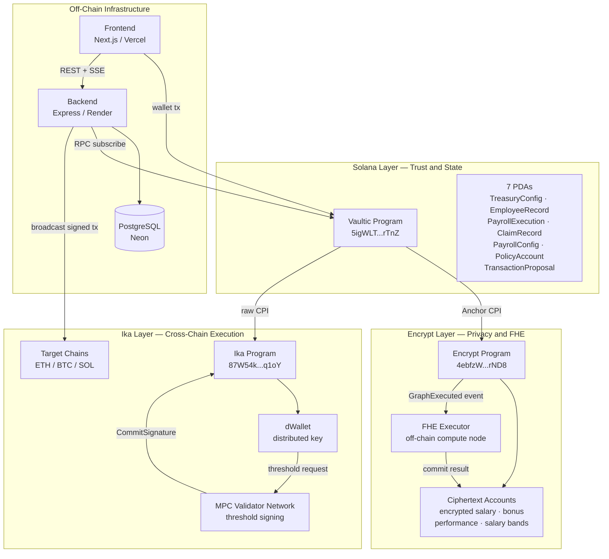

---

### 2. Treasury Initialization Flow

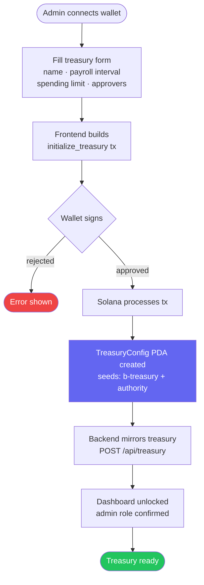

---

### 3. Employee Registration Flow

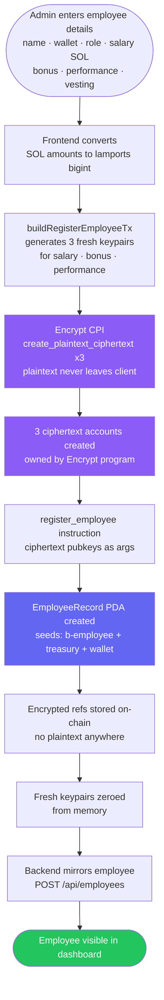

---

### 4. Payroll Execution Flow

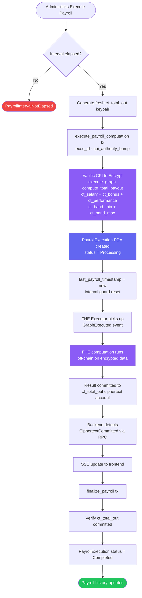

---

### 5. Cross-Chain Salary Claim Flow

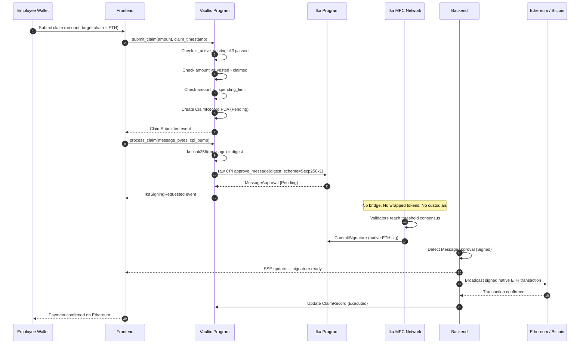

---

### 6. Multi-Sig Policy Enforcement Flow

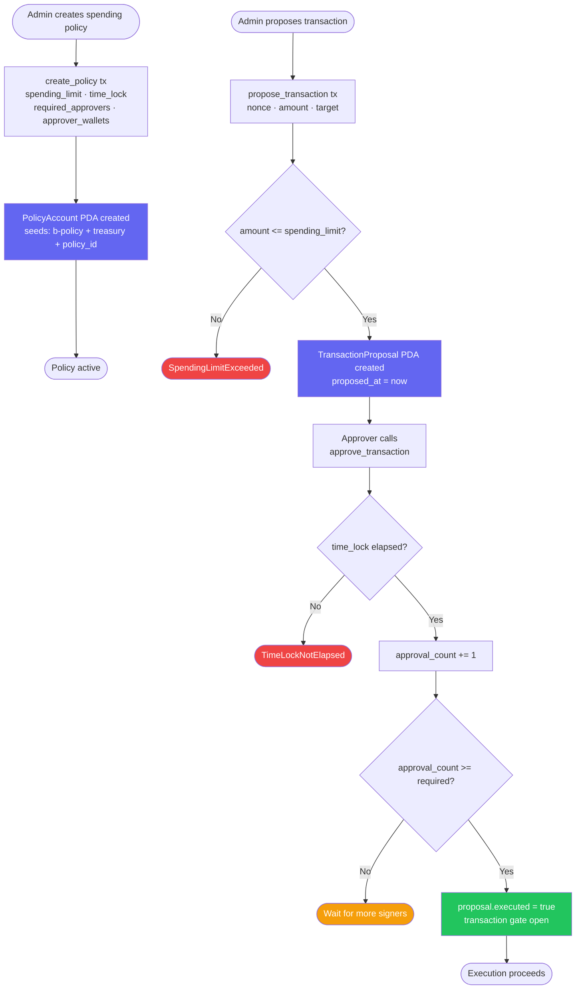

---

### 7. FHE Encryption Lifecycle

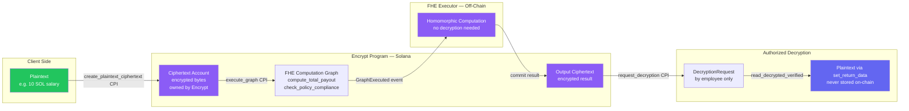

---

### 8. dWallet Signing Architecture

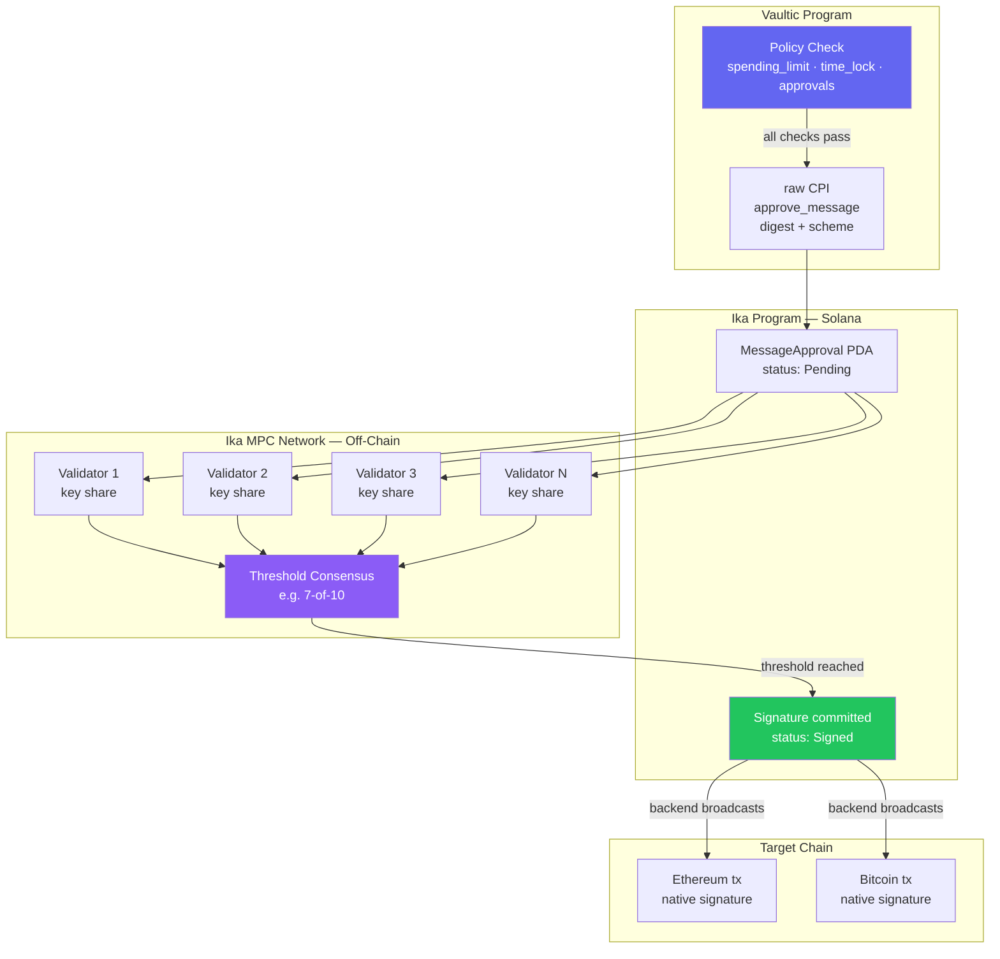

---

### 9. Program Account Structure (PDAs)

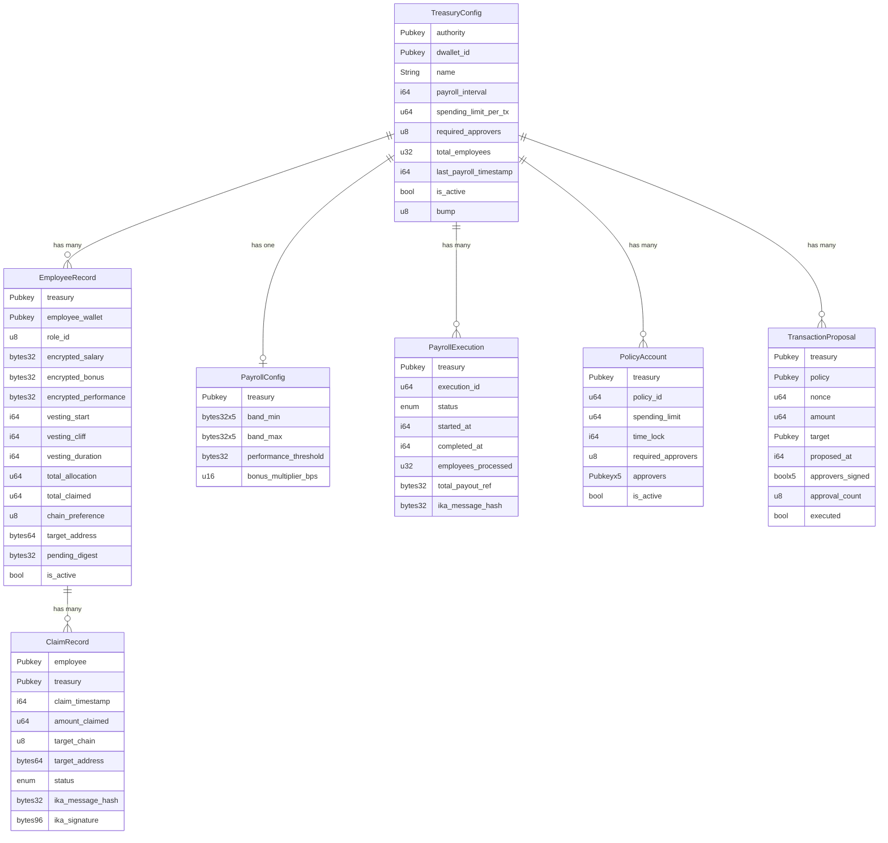

---

### 10. End-to-End User Journey

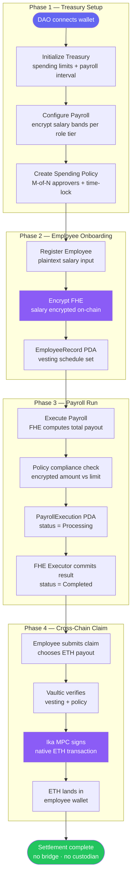

---

### 11. Database Schema

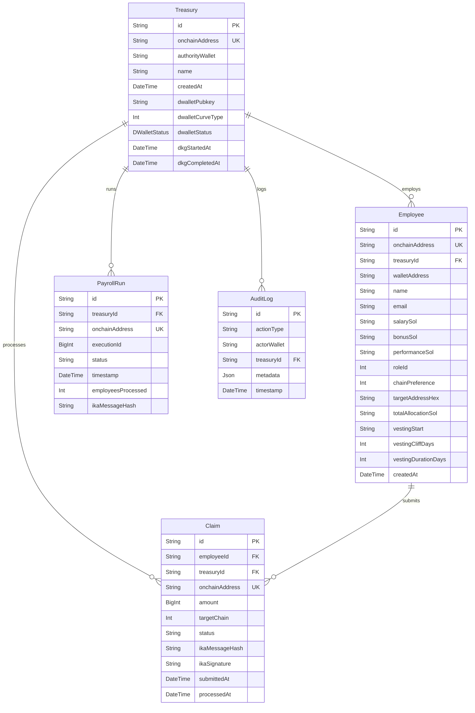
